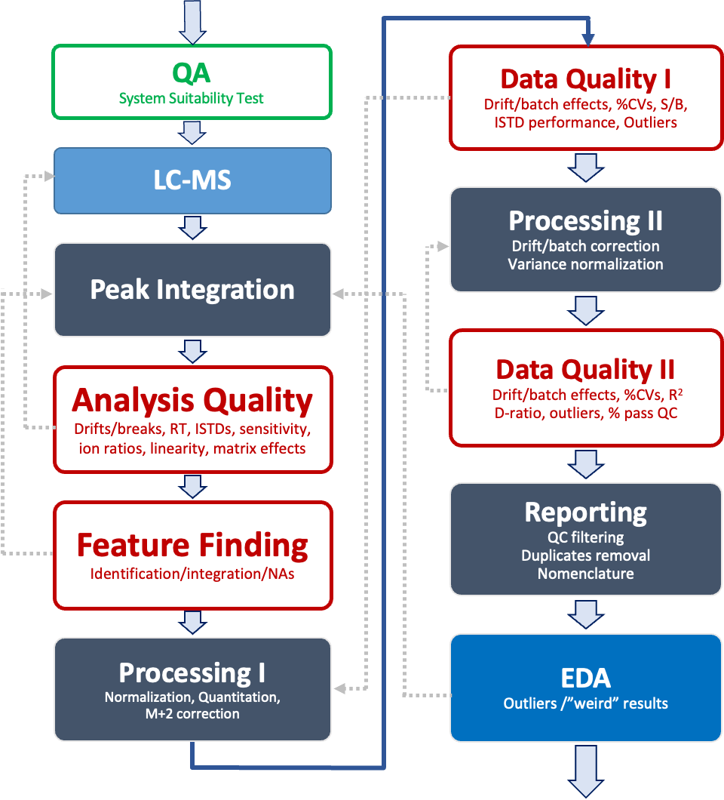
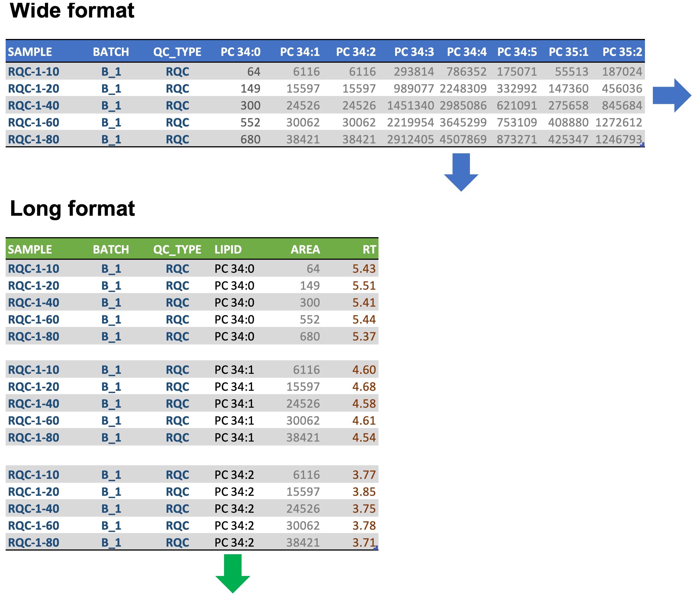

## 1. Introduction

In this workshop, we will walk you through the data analysis of a lipidomics dataset, from data preprocessing and data quality control to statistical analyses and interpretation. We will be using the data and analysis published by Tan et al. on '*Variability of the Plasma Lipidome and Subclinical Coronary Atherosclerosis*' [@tan2022a] as an example for this workshop. The plasma lipidomics data from this study were obtained using liquid chromatography-tandem mass spectrometry( LC-MS/MS) with multiple reaction monitoring (MRM).

In this first part, we will inspect and process the targeted mass spectrometry (MS)-based plasma lipidomics raw dataset, starting from peak areas, moving to data quality control and ending with a table of QC-filtered lipid concentration values. Careful inspection and quality control of an lipidomics raw data is essential for having a high quality dataset. Moreover, the data processing itself can be a source of errors, noise and artefacts. We therefore follow the approach of an automated, but supervised, preprocessing workflow where we perform checks of each preprocessing step.

{style="text-align: center;" width="525"}

## 2. Loading R packages

We first load packages used in this part of the workshop. We will employ several packages from the [`tidyverse`](https://www.tidyverse.org) which can be loaded using `library(tidyverse)`. The [`here`](https://here.r-lib.org) package provides the function `here()` that returns the root of the project. [`broom`](https://broom.tidymodels.org) provides functions to convert outputs of standard R functions such as `t.test` and `lm` into [tidy tables](https://r4ds.had.co.nz/tidy-data.html) (dataframes/tibbles). [`ggpmisc`](https://github.com/aphalo/ggpmisc) extends `ggplot2` with functions useful for plotting models and annotations of axes. [`rgoslin`](http://www.bioconductor.org/packages/release/bioc/html/rgoslin.html) provides a function to normalize lipid names and return structural details from lipid names.

```{r setup}
rm(list=ls()) # Clear all variables and loaded packages 

knitr::opts_chunk$set(collapse = TRUE, echo = TRUE, message = TRUE, warning = FALSE, fig.height=4, fig.width=10, fig.retina=2, comment = "#>", fig.show = "hold")

library(tidyverse)
library(here)
library(broom)
library(ggpmisc)
library(rgoslin)
here::i_am("Part_1/Part1.rmd")
```

## 3. Importing raw data

We start with loading the table with peak areas, which were obtained after peak integration of LC-MS raw data using MRMkit [@teo].

It is always good to check the whether the data was imported correctly, e.g. by inspecting column types. For example, undefined text indicating missing values (e.g. *ND*) within numerical columns, can lead the `read_csv()` to assign a column as text.

```{r import-raw}

d_orig <- readr::read_csv(file = here("Part_1/data/SPERFECT_SLINGpanel_MRMkit_RawAreas_clean.csv"),col_names = TRUE, trim_ws = TRUE, na = c("NA", "ND", "n.d."))
d_orig
```

## 4. Preparing and converting to a long format table

First we clean the imported dataset for easier handling later on. Inconsistent sample and lipid names can be problematic as well and may need to be fixed. In our case, we just clean the sample names by removing `.mzML`. Since the file/sample names do not contain any information on the analysis order, we furthermore add the runorder number `RUN_ID` as first column, knowing that the imported data was in the analysis sequence.

In the second step, we convert the data into the *long (narrow) format*. In the long format, every observation ( = every lipid/sample pair) is a row and columns represent measured variables (e.g. peak area, RT) for each observation (pair) is a row. Especially in this phase of the data analysis the long format is helpful.

{width="467"}

We can convert the format easily in R using the `dplyr` [`pivot`](https://tidyr.tidyverse.org/articles/pivot.html) functions

```{r reshape}
d_orig <- d_orig |> 
  mutate(FILENAME = stringr::str_replace(FILENAME, ".mzML", "")) |> 
  mutate(RUN_ID = row_number(), .before = 1)

d_long <- d_orig |>  
  pivot_longer(names_to = "LIPID", values_to = "AREA", cols = -RUN_ID:-QC_TYPE) %>% 
  arrange(LIPID)

d_long
```

## 5. A first look at the analysis

Now we are ready to have a first look on how the analysis went. For this we inspect the peak areas of internal standards (ISTDs) over the analysis sequence by plotting them. Different QC samples were included in this analysis, which serve different functions (see also: [@broadhurstGuidelinesConsiderationsUse2018]):

-   BQC: Batch (Process) QC
-   TQC: Technical (instrument) QC
-   PBLK: Process (extraction) Blank
-   SBLK: Solvent Blank
-   RQC: Response QCs

```{r plot-runscatter-areas, fig.height=5}

# Filter for ISTDs only
d_istd <- d_long %>% filter(str_detect(LIPID, "ISTD"))
#d_plot <- d_long %>% filter(str_detect(LIPID, "ISTD") & str_detect(LIPID, "Cer"))

# Convert QC_TYPE to a factor and sort, to ensure correct layering in plot
d_istd$QC_TYPE <- factor(d_istd$QC_TYPE, c("SAMPLE", "BQC", "TQC", "PBLK","UBLK","RQC"))
d_istd <- d_istd |> arrange(QC_TYPE)

# Define colors and shapes for each QC_TYPE
qc_colors <- c(SAMPLE = "grey50", BQC = "red", TQC = "blue", 
               PBLK = "green", SBLK = "darkgreen", UBLK = "green2", RQC = "pink3")

qc_shapes <- c(SAMPLE = 1, BQC = 21, TQC = 21, 
               PBLK = 21, SBLK = 23, UBLK = 1,  RQC = 6)

# Plot
p <- ggplot(d_istd, aes(x=RUN_ID, y=AREA)) + 
        geom_point(aes(colour = QC_TYPE, fill = QC_TYPE, shape  = QC_TYPE),
                   size = 1, alpha =0.7, stroke = 0.3) +
        facet_wrap(vars(LIPID), ncol = 5, nrow = 4, scales="free_y") +
        scale_shape_manual(na.value = NA, values = qc_shapes) +
        scale_fill_manual(values = qc_colors, na.value = NA) +
        scale_colour_manual(values = qc_colors, na.value = NA) +
        scale_x_continuous(breaks = seq(0, max(d_istd$RUN_ID), by = 100 )) + 
        scale_y_continuous(limits = c(0, NA)) + 
        theme_bw(base_size = 8) 
ggsave(plot = p, filename = here("Part_1/output/runscatter_ISTD.pdf"),
       width = 280, height = 180, units = "mm")
plot(p)
```

| We observe that the intensity of some ISTDs shows a drift during the analysis. The two ceramide ISTDs show a very different pattern, even they are from the same class.
| The variability of the signals of the ISTD in the samples is comparable to the QCs (BQC and TQC), indicating that the ISTDs are not subjected to a major matrix effect. We also observe that signals of the ISTDs in the **PBLK** (processed blank) containg ISTDs is comparable to the other sample types, suggesting now major matrix suppression or interference. For LPC 18:1 d7 the signals are lower in the samples than in the PBLK.

## 6. Verifying linear response of the measurements

Injected sample amount need to be carefully chose when measuring analytes covering a large concentration range. It is a trade-off between sensitivity and not exceeding the linear range of the measurement, as well as other factors. While protocols define an optimal injected sample amount (volume), the linear range of the the LC-MS system can change, even within an longer analysis sequence. We therefore always check the linear response as a QC, using dilution, or injection volume, series of a pooled QC extract.

Let's plot the response curves from ISTDs measured at the beginning and end of this run. For this we extract the curve number and relative concentration from the sample name.

```{r plot-response,  fig.height=6.5, fig.width=10,}

d_rqc <- d_long |> 
  filter(QC_TYPE == "RQC") |> 
  separate(col = FILENAME, 
           into = c("TYPE","CURVE_NO","AMOUNT"), 
           sep = "-", 
           remove = FALSE, convert = TRUE)
d_rqc$CURVE_NO <- factor(d_rqc$CURVE_NO)
d_rqc$AMOUNT <- as.numeric(d_rqc$AMOUNT)

p <- ggplot(d_rqc |> filter(str_detect(LIPID, "ISTD")), 
            aes(x=AMOUNT, y=AREA, color = CURVE_NO, group = CURVE_NO)) +
        geom_point(size = 2, alpha =0.7, stroke = 0.3) +
        facet_wrap(vars(LIPID), ncol = 5, nrow = 4, scales="free_y") +
        ggpmisc::stat_poly_line(linewidth = 0.5, se = FALSE) +
        ggpmisc::stat_poly_eq(aes(label = after_stat(rr.label)),
                     size = 2.4,
                     lineheight = 1, ) +
        scale_colour_manual(values = c("1" = "cyan4", "2" ="blue3")) +
        scale_x_continuous(limits = c(0, NA)) + 
        scale_y_continuous(limits = c(0, NA)) + 
        labs(x = "Rel. Sample Amount (%)") +
        theme_bw(base_size = 8) 
ggsave(plot = p, filename = here("Part_1/output/reponse_curves.pdf"),
       width = 240, height = 160, units = "mm")
plot(p)
```

| We see that the response is fairly linear for most species, whereby the TG ISTD shows some saturation. The two curves mostly overlap, suggesting no major changes in sensitivity and linearity over this time, except Cer d18:1/12:0 that showed a considerable drift (see Figure 1).

## 7. Verifying lipid identifications

Peak integration of large panels covering many (hundreds) of lipid species needs is challenging. Therefore, it is always good to perform check identification in the final raw dataset. Our data is from a revered phase (RP) - LC where the retention time (RT) increased with increasing carbon chain length and increasing saturation. We can therefore plot the chain length and saturation and possiblly identify potential miss annotations.

We import the 'peak info' table obtained during peak integration with MRMkit. This data file also contains the precurson and product ion m/z values. To obtain the chain length and saturation from each lipid species, we use the [`rgoslin`](http://www.bioconductor.org/packages/release/bioc/html/rgoslin.html) package. `rgoslin` furthermore converts lipid names of different 'dialects' to a normalized standard name. However, `rgoslin` is not able to understand all 'in-house' dialects, so we provide it with cleaned lipid names, which are also found in the 'peak info' table.

```{r get-chain-info}
d_lipids <- readr::read_csv(file = here("Part_1/data/SPERFECT_SLINGpanel_MRMkit_peakQC.csv"), show_col_types = FALSE)


# We get the class names and remove the isotope info in []
d_lipids <- d_lipids |>
  mutate(LIPID_tmp = str_replace(LIPID, " O\\-", "-O "),
         LIPID_tmp = str_replace(LIPID_tmp, " P\\-", "-P "), .after = LIPID) |> 
  separate(LIPID_tmp, into = c("CLASS", "CHAINS", "OTHER"), 
           sep = " ", remove = TRUE, extra = "drop") |> 
  mutate(LIPID_NAME_CLEAN = str_remove(LIPID_NAME_CLEAN, "\\[.*"))

# rgoslin needs a vector with lipid names
d_goslin <- rgoslin::parseLipidNames(unique(d_lipids$LIPID_NAME_CLEAN))

d_goslin_sel <- d_goslin |> 
  select(Original.Name, Normalized.Name, Lipid.Maps.Main.Class, Total.C, Total.DB) 

d_lipid_info <- d_lipids |> left_join(d_goslin_sel, by=c("LIPID_NAME_CLEAN"="Original.Name"))

```

And now let's plot the data. Note that in this example we plot all the species, before we applied any QC. Depending on your workflow this step may be better used after QC filtering.

```{r chain-vs-rt-plot,  fig.height=6.5, fig.width=10}

d_lipid_info$Total.DB <- factor(d_lipid_info$Total.DB)

p <- ggplot(d_lipid_info |> drop_na(Total.C), 
            aes(x=Total.C, y=RT, color = Total.DB, group = Total.DB)) +
        geom_point(size = 2, alpha =0.75, stroke = 0.3) +
        facet_wrap(vars(CLASS), ncol = 6, nrow = 6, scales="free") +
        ggpmisc::stat_poly_line(method = "lm", linewidth = 0.5, se = FALSE, na.rm = TRUE) +
        ggpmisc::stat_poly_eq(aes(label = after_stat(rr.label)),
                     size = 2.4,
                     lineheight = 1, na.rm = TRUE ) +
        labs(x = "Rel. Sample Amount (%)") +
        theme_bw(base_size = 8) 
ggsave(plot = p, filename = here("Part_1/output/chain_vs_rt.pdf"),
       width = 260, height = 160, units = "mm")
plot(p)

```

## 8. Normalization and quantification

```{r process-data}
d_istd_map <- readr::read_csv(file = here("Part_1/data/ISTD_mapping.csv"),
                          col_names = TRUE, trim_ws = TRUE, col_types = "c")

d_istd_conc <- readr::read_csv(file = here("Part_1/data/ISTD_conc.csv"),
                          col_names = TRUE, trim_ws = TRUE, col_types = "c")

d_processed <- d_long |> 
  left_join(d_istd_map, by = c("LIPID")) |> 
  left_join(d_istd_conc, by = c("ISTD")) |> 
  mutate(isISTD = (LIPID == ISTD)) |> 
  group_by(ISTD, FILENAME) |> 
  mutate(normAREA = AREA/AREA[isISTD],
         CONC = normAREA * RF * ISTD_conc_nM/1000 * 4.5/ 10) |> 
  ungroup()
```

## 9. Inspecting the normalized data

Normalization with the class-specific ISTD often helps to remove systematic drifts and batch effects, but may also introduce additional noise and artefacts. Let's have a look on the how the data looks after normalization.

Before we plotted the ISTD runscatter in one page, however if we would like to look at all spececies we could distribute the plots over several pages. There are different ways to archive this. One possibility is using `facet_wrap_paginate()` from the `ggforce` package, but this can be slow when having large datasets. We here are using another, manual, approach, by slicing the long table into pages that will then be plotted.

Furthermore, since we are going to use this plot again later, we make function for this plot, so that we can coveniently plot again later.

```{r plot-runscatter-conc, warning: false, message: false}

# We define the function

runscatter <- function(data, var){
  plot_page <- function(data, nrows, ncols){
   ggplot(data, aes(x=RUN_ID, y={{var}})) + 
          geom_point(aes(colour = QC_TYPE, fill = QC_TYPE, shape  = QC_TYPE),
                     size = 1, alpha =0.7, stroke = 0.3) +
          facet_wrap(vars(LIPID), ncol = ncols, nrow = nrows, scales="free_y") +
          geom_smooth(data= subset(data, QC_TYPE=="BQC"), aes(x=RUN_ID, y={{var}}), 
                      method = "loess", span = 0.75, formula = y ~ x, se = FALSE,
                      na.rm = TRUE, color = "brown3", linewidth = .7)+
          scale_shape_manual(na.value = NA, values = qc_shapes) +
          scale_fill_manual(values = qc_colors, na.value = NA) +
          scale_colour_manual(values = qc_colors, na.value = NA) +
          scale_x_continuous(breaks = seq(0, max(d_istd$RUN_ID), by = 100 )) + 
          scale_y_continuous(limits = c(0, NA)) + 
          theme_bw(base_size = 8) 
   }
  rows_page = 5
  columns_page = 5
  #get a table with page numbers for each lipid species
  d_pages <- data |> select(LIPID) |> distinct() |> 
    mutate(page_no = ceiling(row_number() / (rows_page * columns_page)))
  
  #plot each page from a nested table
  d_plots <- data %>%
    filter(!str_detect(QC_TYPE, "BLK|RQC"), !str_detect(LIPID, "ISTD")) |> 
    left_join(d_pages, by = "LIPID") %>%
    group_by(page_no) |> 
    nest() |> 
    mutate(plt = map(data, ~ plot_page(., rows_page, columns_page)))
  
  # Save pages to a PDF. 
  pdf(file = here(paste0("Part_1/output/runscatter_", quo_name(enquo(var)), ".pdf")),
      onefile = TRUE, width = 280/25.4, height = 180/25.4)
  #d_plots$plt 
  invisible(purrr::walk(d_plots$plt, print)) # use this to prevent printing of index
  dev.off()
}
# and run it twice, plotting raw areas and concentrations

runscatter(d_processed, AREA)
runscatter(d_processed, CONC)
```

## 10. Drift and batch correction

We observe some drifts in some lipid species - this even after normalization with the ISTD. We will now try to correct these drifts. While drifts are often cause by gradual changes in instrument performance, batch effects can e.g. occur when samples are extracted in batches or when e.g. the instrument needs to be stopped. In both cases, we here assume that the that the `BQC` (=batch/process QC) represent drift and batch effects seen also in the study samples. First, we apply an within-batch smoothing, and then align the batches using median centering.

For the smoothing in the code example below, we will use `loess` based on log-transformed data to make it more robust. Setting of the smoothing parameter, i.e. `loess span`, depends on your data, we will chose the default of 0.75.

Note, that for the analysis in the publication another algorithm, built-in to MRMkit [@teo], was used, which is based on the all data points rather than just QCs.

```{r}
d_processed_corr <- d_processed # make a new copy

get_loess <- function(d) {
  tryCatch({
    dt <- tibble::tibble(RUN_ID = seq(min(d$RUN_ID), max(d$RUN_ID), 1))
    res <- stats::loess(
      data = subset(d, QC_TYPE == "BQC"), formula = CONC_LOG ~ RUN_ID, span = 0.75) |> 
      stats::predict(dt) %>% as.numeric()
    res},
  error = function(e) {return(rep(NA_real_, length(d$RUN_ID)))})
}

# Within-batch smoothing

d_processed_corr$CONC_LOG <- log2(d_processed_corr$CONC)

d_processed_corr <- d_processed_corr |> 
  group_by(LIPID, BATCH) |>  
  nest() |>
  mutate(Y_PREDICTED = purrr::map(data, \(x) get_loess(x))) |> 
  unnest(cols = c(data, Y_PREDICTED))

d_processed_corr <- d_processed_corr %>%
  group_by(LIPID, BATCH) |> 
  mutate(Y_PREDICTED = Y_PREDICTED - median(Y_PREDICTED, na.rm = TRUE),
         CONC_ADJ = 2^(CONC_LOG - Y_PREDICTED)) |> ungroup()

# Between-batch median-centering

d_processed_corr <- d_processed_corr |> 
  dplyr::group_by(LIPID,  BATCH) |> 
  dplyr::mutate(CONC_ADJ = CONC_ADJ/median(CONC_ADJ[QC_TYPE == "BQC"], na.rm = TRUE)) |> 
  dplyr::ungroup()
d_processed_corr <- d_processed_corr |> 
  dplyr::group_by(LIPID) |> 
  dplyr::mutate(CONC_ADJ =  CONC_ADJ * median(CONC_ADJ[QC_TYPE == "BQC"], na.rm = TRUE)) |> 
  dplyr::ungroup()

runscatter(d_processed_corr, CONC_ADJ)

```

## 11. Calculate quality-control (QC) values

To evaluate the quality of the analysis and to filter the date we calculate different QC values for each lipid species. This included the analytical coefficient of variation (%CV) based on the BQCs, the signal-to-blank ratio, and the r squared of the response curves.

A word of caution here: we apply drift/batch correction to all species here, regardless if there are drift/batch effects. Such correction can also introduce variability and artefacts. Furthermore, we are using the BQCs for smoothing and median centering, the %CVs of the BQCs are therefore as consequence. Ideally we would use a QC subset or another QC set to determine the %CV.

```{r calc-qc}

## run this line below if you want test QC filtering without drift/batch correction
#d_processed_corr <- d_processed |> mutate(CONC_ADJ = CONC) # !!!!!!! overwrites correction

rsd <- function(x) sd(x, na.rm = TRUE)/mean(x, na.rm = TRUE)

d_qc_1 <- d_processed_corr |> 
  group_by(LIPID) |> 
  summarise(
    Area_SPL = median(AREA[QC_TYPE == "SAMPLE"], rm.na = TRUE),
    SB_ratio = Area_SPL/median(AREA[QC_TYPE == "PBLK"], rm.na = TRUE),
    Conc_SPL = median(CONC_ADJ[QC_TYPE == "SAMPLE"], rm.na = TRUE),
    CV_TQC = rsd(CONC_ADJ[QC_TYPE == "TQC"]) * 100,
    CV_BQC = rsd(CONC_ADJ[QC_TYPE == "BQC"]) * 100,
    CV_SPL = rsd(CONC_ADJ[QC_TYPE == "SAMPLE"]) * 100,
    D_ratio = sd(CONC_ADJ[QC_TYPE == "BQC"])/sd(CONC_ADJ[QC_TYPE == "SAMPLE"])) |> ungroup()

f <- function(x) broom::glance(lm(AREA ~ AMOUNT, data = x))

d_qc_2 <- d_rqc |> 
  group_by(LIPID, CURVE_NO) |>
  nest() |> 
  mutate(res = purrr::map(data, f)) |> 
  unnest(res)

d_qc_2 <- d_qc_2 |> 
  select(LIPID, CURVE_NO, r.squared, p.value) |> 
  pivot_wider(names_from = CURVE_NO, values_from = c(r.squared, p.value))

d_qc <- d_lipids |> 
  left_join(d_qc_1, by = "LIPID") |> 
  left_join(d_qc_2, by = "LIPID")

write_csv(x = d_qc, file = here("Part_1/output/QC-summary.csv"))
```

## 12. QC-filtering of dataset

Now we apply a QC-filtering step to the data using our chosen criteria, e.g. CV \< 25%. You can play we these parameters and see how it affects the number of species that pass/fail this step.

For some lipid classes, i.e. DGs , each species was measured via 2 transitions. Which transition is used for quantification was indicated in the metadata file (peakQC), so we can filter for quantifiers. Futhermore, we exclude the ISTDs from the final dataset.

```{r qc-filter}
d_qc <- d_qc |> 
  mutate( 
    QC_pass = 
    (CV_BQC < 25 | (CV_BQC < 50 & D_ratio < 0.5)) & 
    SB_ratio > 3 &
    r.squared_1 > 0.8 &
    QUANTIFIER &
    !str_detect(LIPID, "ISTD"))

print(paste0("QC filtering: ", nrow(d_qc[d_qc$QC_pass, ]), " of ", nrow(d_qc), " species passed QC"))

```

So, a total of `r nrow(d_qc[d_qc$QC_pass, ])` of `r nrow(d_qc)` species passed QC. Let us check, if there are lipid classes with many species that failed QC.

## 13. Inspecting the QC-filtering

We now can (and should) have a look at how many species passed the QC criteria and if there are any pattern specific to lipid classes.

```{r plot-qc-filter}

d_qc_summary <- d_qc |> filter(QUANTIFIER) |> dplyr::count(CLASS, QC_pass) 

ggplot(d_qc_summary, 
       aes(x = CLASS, y = n, fill = QC_pass, group = QC_pass)) +
  geom_bar(position="stack", stat="identity") + 
  scale_fill_manual(values = c("FALSE" = "#d6cac9", "TRUE" = "green4")) + 
  scale_x_discrete(limits=rev)+
  coord_flip() + theme_bw()
```

## 14. Saving the final dataset

We now save the final, drift-corrected and QC-filtered concentration data as a wide CSV table, which will then be used for Part 2.

```{r save-processed-data}

# QC filter data
d_final <- d_processed_corr |> 
  filter(QC_TYPE == "SAMPLE", !str_detect(LIPID, "ISTD")) |> 
  right_join(d_qc[d_qc$QC_pass,"LIPID"], by = "LIPID")

d_final_wide <- d_final |> 
  pivot_wider(id_cols = c(FILENAME, QC_TYPE), names_from = "LIPID", values_from = "CONC_ADJ") 

write_csv(d_final_wide, here("Part_1/output/qc_filtered_results.csv"))
```

# References
