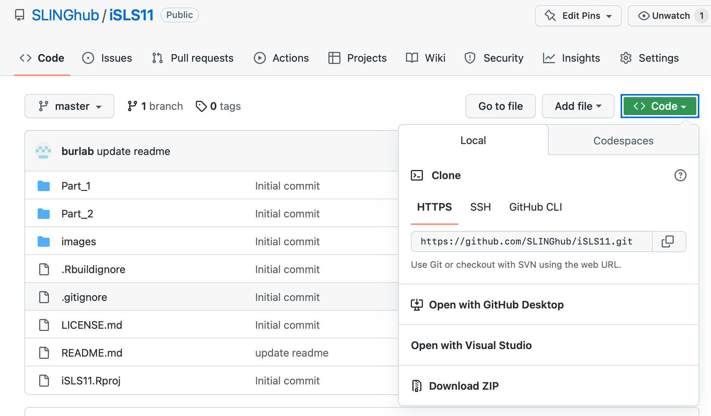

# WS2 - Clinical Lipidomics Data Analysis

*iSLS11 Workshop on Data Processing and Statistical Analysis*

## Summary

This repository contains datasets and R codes used for 11th International Singapore Lipid Symposium [iSLS11](https://sling.sg/news-events/isls/) workshop held on March 19, 2023, 2:00 - 6:00 PM (SGT).

We will be using the data published in [*Tan et al., Variability of the Plasma Lipidome and Subclinical Coronary Atherosclerosis, Atheroscler Thromb Vasc Biol, 2021*, DOI: 10.1161/atvbaha.121.316847](https://doi.org/10.1161/atvbaha.121.31684) as an example dataset for this workshop.

**In the first part**, we will inspect and process a targeted MS-based plasma lipidomics raw dataset, starting from peak areas. In particular, we will be looking at import of analytical data and metadata, internal standard-based normalization and quantification, diverse analytical and data quality control assessments and plots, batch/drift-correction, lipid nomenclature, QC-based feature filtering and reporting. We will go through the processing workflow step-by-step using R scripts/notebooks with relevant R packages.

**In the second part**, we will inspect the overall data trends from both sample meta data and lipidomics data via visualization and dimension reduction. The data set comes from a lipidomics study of individuals at high risk of cardiovascular diseases, where the participants were invited monthly for blood sampling up to five times and their coronary artery plaque burden was assessed using computed tomography coronary angiography (CTCA) at the end of the follow-up. Using custom R code, we practice synchronizing the quantitative lipidomic data and their plaque burden data (outcome) and cluster subjects by different plaque types. Using the repeated measure data and linear mixed effects model, we compute population-level properties of lipid species such as within-individual and between-individual variability (coefficients of variation). Finally, we search for lipid species whose visit-to-visit variability is associated with different plaque types.

## Preparing for the workshop

### R and RStudio

-   R (version 4.1 (or higher). Download from <https://cloud.r-project.org/>. Check your R version by running following command in your console: `R.Version()$version.string`

-   RStudio (newest version, at least 2022.02). Download from <https://posit.co/download/rstudio-desktop/>. Check your `RStudio` version by either looking clicking *About RStudio* under the menu *Help.*

### R packages

We will make use of several external R packages in our scripts. Please install them before the start of the workshop them running following lines in your R console:

    # CRAN packages

    install.packages(c("here", "tidyverse", "broom", "ggrepel", "ggpmisc", "circlize", "scales", "devtools"))

    # Bioconductor packages

    if (!require("BiocManager", quietly = TRUE)) install.packages("BiocManager") 
    BiocManager::install(c("impute", "ComplexHeatmap"))

### Download the R scripts

Download the R Project containing the scripts and data used in this workshop from this repository. Alternatively you can clone this repository in RStudio/git.

{width="327"}

Do not hesitate to contact us if you have any questions.

## Authors

-   Bo Burla - [Singapore Lipidomics Incubator \@ National University of Singapore](https://sling.sg)

-   Hyungwon Choi - [Computational & Statistical Systems Biology Laboratory \@ National University of Singapore](https://www.cssblab.org)

## Acknowledgments

-   Federico Torta
-   Members of SLING
-   Participants of the SLING R-sessions

## License

This project is licensed under the MIT License - see the [LICENSE.md](LICENSE.md) file for details
